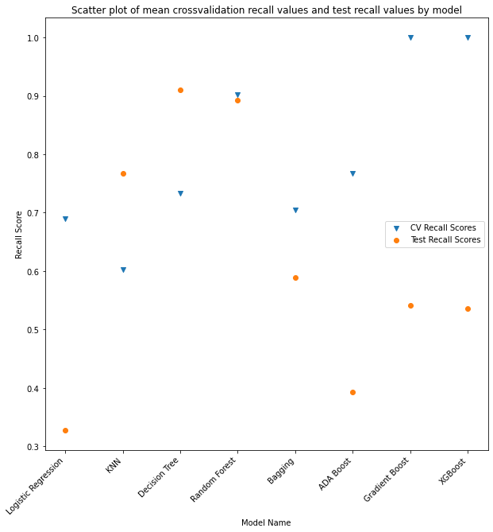
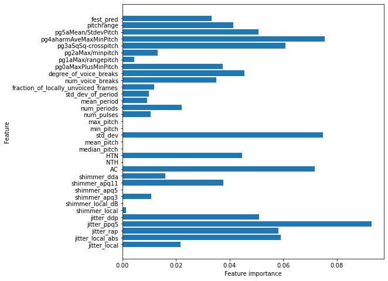

# Title

**Author**: Eric Hansen

## Overview


A modelling workflow to investigate the viability of identifying Parkinson's Disease based on voice sample data.
Methods: OSEMN; data cleaning, feature engineering, logistic regression, k-nearest neighbors, decision trees, random forests, bootstrap aggregation/bagging, adaboost, gradient boost, xgboost
# Results  

Results: Random Forest model was able to identify with ~90% recall score.  Features of greatest importance include: jitter_ppq5, pg4aharmAveMaxMinPitch, std_dev (of pitch), AC, and pg3aSqSq-crosspitch. Pg4 and pg3 were engineered features.

Recommendations: Actionable items:  
Increase weight of these human-readable voice features in diagnosis.  
Add this model to the suite of diagnosis tools to improve and/or potentiall speed up diagnosis.


## The Problem
Parkinson's is a long-term degenerative disorder of the human nervous system. Mainly affecting the motor system, patients with Parkinson's (PWP) have symptoms including tremor, slowness of movement, and difficulty walking and speaking. Parkinson's affects approximately seven million people globally and one million people in the US.


## Data

Erdogdu Sakar, B., Isenkul, M., Sakar, C.O., Sertbas, A., Gurgen, F., Delil, S., Apaydin, H., Kursun, O., 'Collection and Analysis of a Parkinson Speech Dataset with Multiple Types of Sound Recordings', IEEE Journal of Biomedical and Health Informatics, vol. 17(4), pp. 828-834, 2013.

As found on
https://archive.ics.uci.edu/ml/datasets/Parkinson+Speech+Dataset+with++Multiple+Types+of+Sound+Recordings#

And available
https://www.researchgate.net/publication/260662600_Collection_and_Analysis_of_a_Parkinson_Speech_Dataset_With_Multiple_Types_of_Sound_Recordings

NB: The data found here are not raw sound files. It has already been processed, filtered, and decomposed to extract numerous frequency, amplitude, and other metrics, which are found in this data set.


## Column Names and descriptions for Speech Data
### Frequency parameters
Jitter is a measure that reflects the variation of the successive periods; analysis estimates the underlying timing of the fundamental period.  It is a frequency variation metric.

Jitter (local): Represents the average absolute difference between two consecutive periods, divided by the 
average period.  

Jitter (local, abs): Represents the average absolute difference between two consecutive periods.  

Jitter (rap): Represents the average for the disturbance, i.e., the average absolute difference of one period 
and the average of the period with its two neighbors, divided by the average period.  

Jitter (ppq5): Represents the ratio of disturbance within five periods, i.e., the average absolute difference 
between a period and the average containing its four nearest neighbor periods, i.e. two previous and two 
subsequent periods, divided by average period.  

Jitter (ddp): This is the average absolute difference between consecutive differences between consecutive periods, divided by the average period.  

### Amplitude Parameters
Shimmer is a measure that reflects variation of the amplitude over time; it is an amplitude variation metric, with respect to the maximum peak amplitude.  

Shimmer (local): Represents the average absolute difference between the amplitudes of two consecutive 
periods, divided by the average amplitude. 

Shimmer (local, dB): Represents the average absolute difference of the base 10 logarithm of the difference 
between two consecutive periods.  

Shimmer (apq3): represents the quotient of amplitude disturbance within three periods, in other words, the 
average absolute difference between the amplitude of a period and the mean amplitudes of its two neighbors, 
divided by the average amplitude. 

Shimmer (apq5): Represents the ratio of perturbation amplitude of five periods, in other words, the average 
absolute difference between the amplitude of a period and the mean amplitudes of it and its four nearest 
neighbors, divided by the average amplitude. 

### Harmonicity Parameters
HTN: Harmonic to noise ratio.  (I would interpret this as a measure of the "purity" of pitch, relative to extraneous pitches).
ratio of ACfundamental to difference between ACfundamental and ACfirst harmonic.
NTH:  Noise to Harmonic ratio.  

AC: Autocorrelation - in general, a mathematical representation of the degree of similarity between a given time series and a lagged version of itself over successive time intervals; i.e., the correlation of a signal with itself in later time periods. (In this case, this may be adjusted to have to do with the value of the first peak of the period graph - represents the fundamental frequency; used in HTN and NTH)

### Pitch Parameters
Pitch: how the human ear perceives sound frequencies - e.g. high/low.  The note or tone or sound frequency.
Median Pitch, mean pitch, std_dev, min_pitch, max_pitch: descriptive stats for pitch.

### Pulse parameters
Period: in general, the reciprocal of frequency - the length in time of one cycle.  In context of pulse, however, this may have additional connotation.
Pulse: in general, a rapid, transient change from a baseline signal to a different value, followed by a rapid return to baseline.  
Num_pulses, num_periods, mean_period, std_dev_of_period: descriptives for period

### Voicing Parameters
(source: https://fon.hum.uva.nl/praat/manual/Voice_1__Voice_breaks.html)  
fraction_of_locally_unvoiced_frames: This is the fraction of pitch frames that are analysed as unvoiced; subject to a pitch floor.

Number of voice breaks: The number of distances between consecutive pulses that are longer than 1.25 divided by the pitch floor. Thus, if the pitch floor is 75 Hz, all inter-pulse intervals longer than 16.6667 milliseconds are regarded as voice breaks.

Degree of voice breaks: This is the total duration of the breaks between the voiced parts of the signal, divided by the total duration of the analysed part of the signal 


UPDRS: Unified Parkinson’s Disease Rating Scale; inconsistent between train/test set, so unused.  
    See https://www.theracycle.com/resources/links-and-additional-resources/updrs-scale/ for details

Class_info: target column, whether or not the patient has Parkinson's Disease

## Methods

I did some data cleaning to remove unwanted columns.  I engineered some features (e.g. monotonicity, oral festination) to potentially model some non-linear relationships among the features.
I set up a suite of models, optimized them using gridsearchCV, and measured their recall score mean over cross validation and recall score on a test set.
I also set up a pipeline on the highest scoring model and pickled the result for easy export and portability.

## Results
Models, along with their mean-CV-training set and test set recall score:
- logisticregression: 69%, 33%
- knn: 60%, 77%
- decision tree: 73%, 91%
- random forests: 90%, 89%
- bagging: 70%, 59%
- adaboost: 77%, 39% 
- gradientboost: 100%, 54%
- xgboost: 100%, 54%



The model we chose as best, Random Forests, had these top 5 most important features: jitter_ppq5, pg4aharmAveMaxMinPitch, std_dev (of pitch), AC, and pg3aSqSq-crosspitch.  



## Conclusions

Random forests model (along with several other viable options) could be incorporated into diagnosis procedures to improve PD diagnosis.
Actionable items:
- Highlight human-recognizable voice features which appear as strong predictors of PD
- Incorporate automated voice-analysis diagnosis techniques
- Extend study to following patients over time to try to identify which features could be early-diagnosis features.

## For More Information

Please review our full analysis in [our Jupyter Notebook](./phase_3_project_notebook_final.ipynb) or our [presentation](./'Project 3_EH_pdf.pdf').  

 

For any additional questions, please contact **Eric Hansen, ericthansen at gmail.com**

## Repository Structure

Describe the structure of your repository and its contents, for example:

```
├── __init__.py                         <- .py file that signals to python these folders contain packages
├── README.md                           <- The top-level README for reviewers of this project
├── phase_3_project_notebook_final.ipynb   <- Narrative documentation of analysis in Jupyter notebook
├── Project 3_EH_pdf.pdf        <- PDF version of project presentation

└── images                              <- Both sourced externally and generated from code
```
